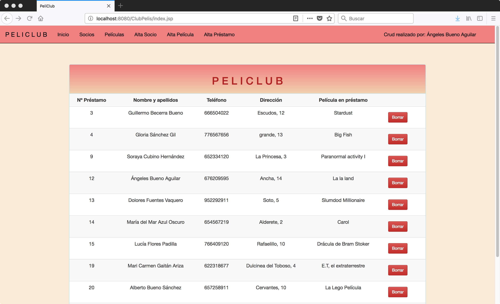
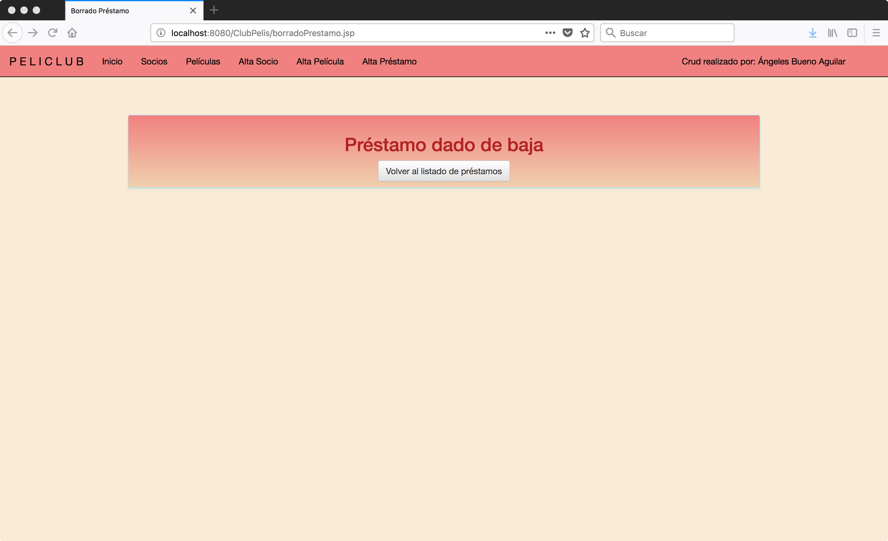
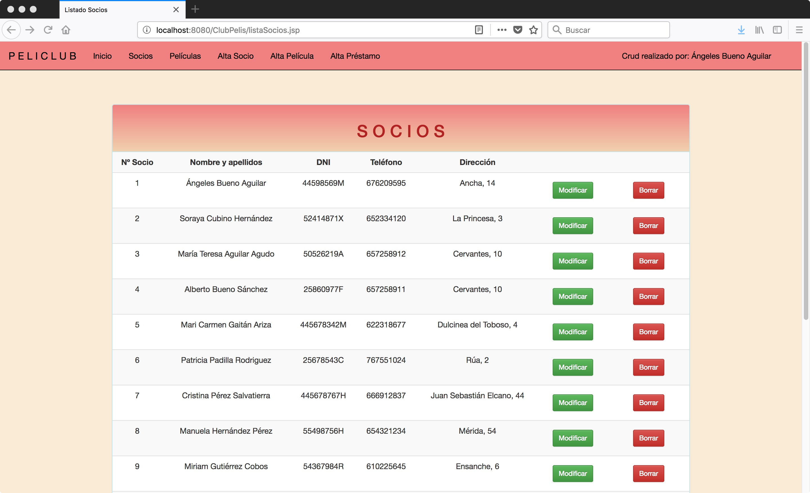
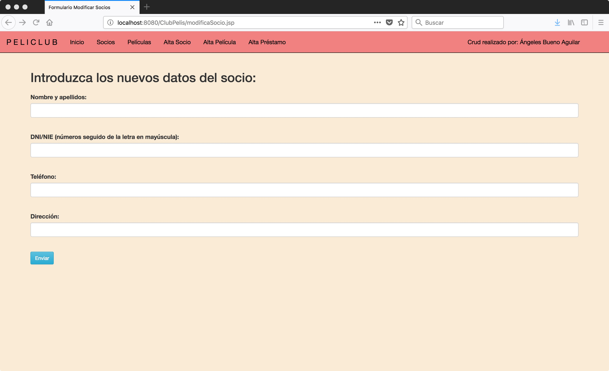
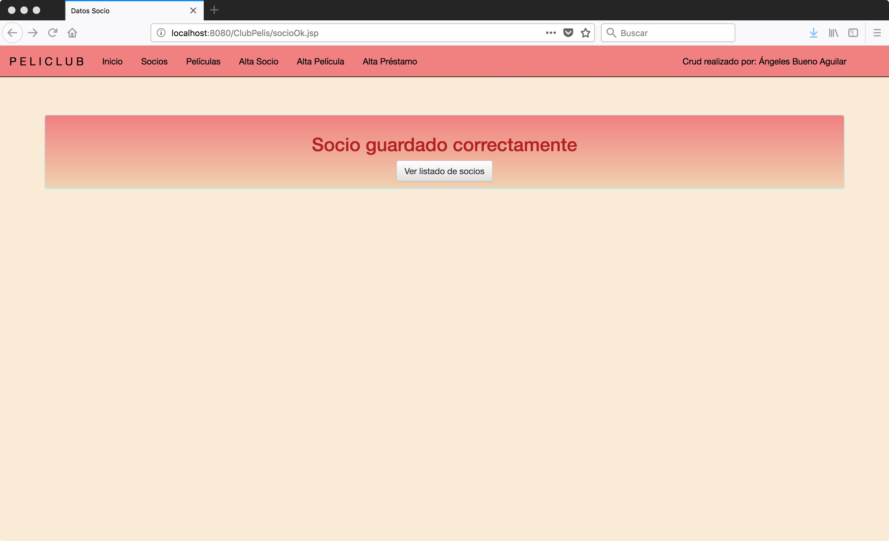
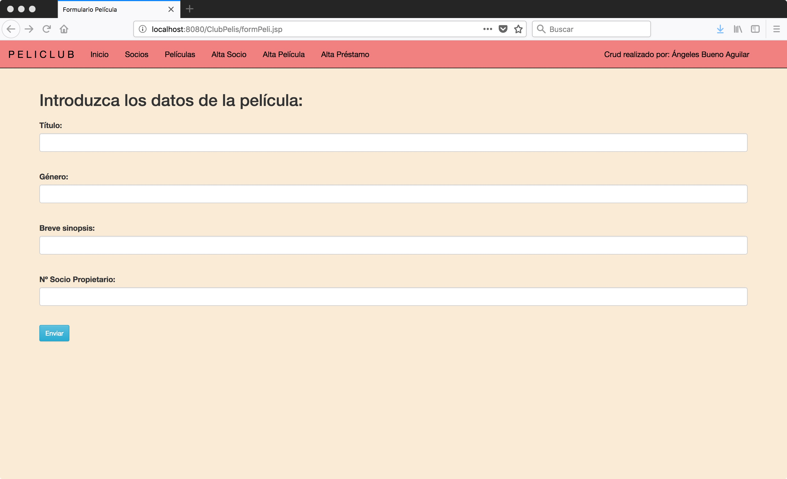
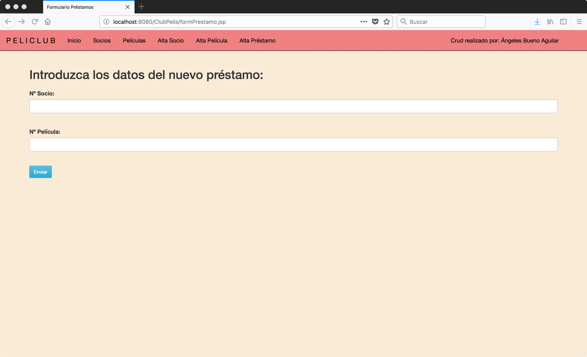
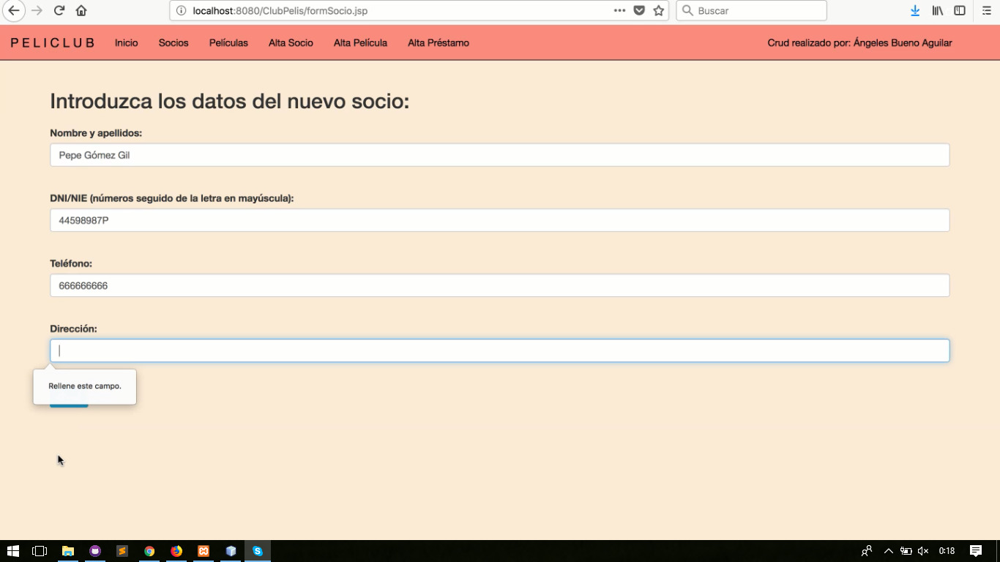
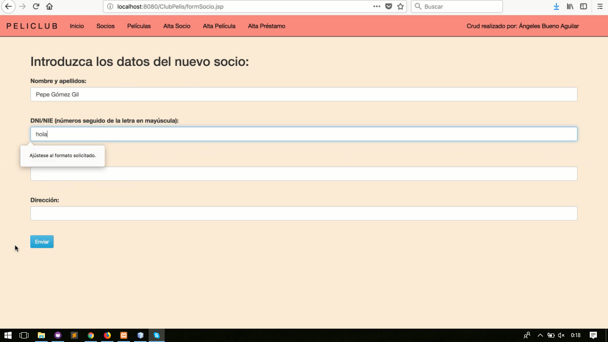
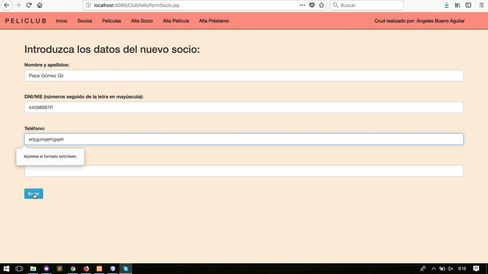

# CRUD_JSP 
## Realizado por: Ángeleles Bueno Aguilar

El CRUD está basado en un club de películas entre amigos.

En todo el sitio web se puede encontrar una barra de navegación para ir de una página a otra. Tanto al pinchar en el título como en inicio, siempre devolverá a la index.

### Índex: Se muestra el listado de todos los préstamos con la opción de poder borrar el préstamo que se considere.

### Al darle a borrar, redireccionará a otra página donde indica que se ha podido borrar correctamente.

### Socios: Se muestra el listado de todos los socios dados de alta con la opción para poder borrar o modificar los datos de los mismos.

### Al darle a modificar, redireccionará a otra página donde se podrá rellenar el formulario con los datos nuevos.

### Al darle a borrar, aparecerá un mensaje y botones para seleccionar una nueva acción.

### Películas: Se muestra el listado de todas las películas registradas con la opción para poder borrar o modificar sus datos.

### Al darle a modificar, redireccionará a otra página donde se podrá rellenar el formulario con los datos nuevos.

### Al darle a borrar, aparecerá un mensaje y botones para seleccionar una nueva acción.

### Alta Socio: Formulario donde rellenar los datos de los socios nuevos.

### Al enviar los datos, si los datos son correctos y el DNI no está repetido y, por tanto, ese socio no existe previamente, aparecerá un mensaje dando el Ok. Si, por el contrario, el DNI estuviera repetido, saltara un error.

### Alta Película: Formulario donde rellenar los datos de las nuevas películas.

### Alta Préstamo: Formulario donde introducir el número de socio y el número de la película que quiere adquirir. Si la película ya estuviera en poder de otro socio, saltaría un mensaje que lo indica.

### En todos los formularios: Todos los campos son obligatorios. Si no se rellena alguno, un mensaje lo indicará. En los campos para Dni y para teléfono, se debe rellenar con el formato correcto.

